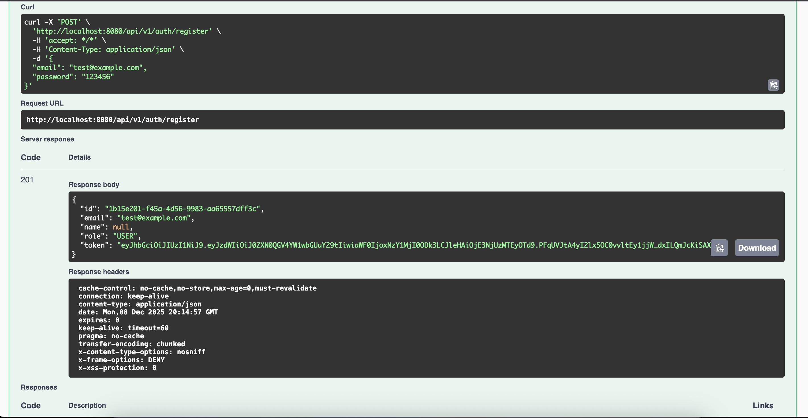
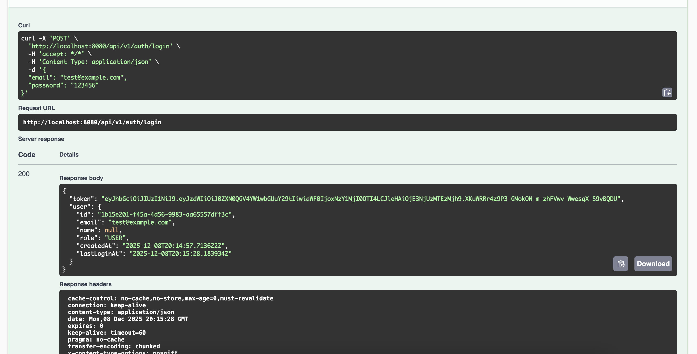

# 🏋️ Gym Management System

Sistema completo de gestión para gimnasios con autenticación JWT y arquitectura hexagonal.
[]
---

## ✨ Features

### 🔐 Authentication & Authorization
- ✅ Registro de usuarios con validación de email
- ✅ Login con JWT authentication
- ✅ Tokens con expiración configurable
- ✅ Password hashing con BCrypt

### 👥 User Management
- ✅ CRUD completo de usuarios
- ✅ Búsqueda por ID
- ✅ Listado de usuarios
- ✅ Actualización de perfil
- ✅ Eliminación de usuarios

### 🏗️ Architecture & Quality
- ✅ Arquitectura hexagonal (Clean Architecture)
- ✅ 22 tests (unitarios + integración)
- ✅ SOLID principles
- ✅ Global exception handling
- ✅ Audit timestamps (createdAt, updatedAt, lastLoginAt)

---

## 🛠️ Tech Stack

### Backend
| Technology | Purpose |
|------------|---------|
| **Java 17** | Programming language |
| **Spring Boot 3.5** | Framework |
| **Spring Security** | Authentication & Authorization |
| **JWT** | Token-based auth |
| **JPA/Hibernate** | ORM |
| **H2** | Database (dev/test) |
| **PostgreSQL** | Database (prod ready) |
| **Maven** | Build tool |
| **JUnit 5** | Testing framework |
| **Mockito** | Mocking framework |
| **Swagger/OpenAPI** | API documentation |

### Architecture Patterns
- **Hexagonal Architecture** (Ports & Adapters)
- **Command Pattern** (Use case inputs)
- **Repository Pattern** (Data access)
- **Value Objects** (Domain validation)
- **Dependency Inversion**

---

## 📸 Screenshots

### Swagger API Documentation


### Authentication Endpoints


### Register User Example


### Register User Request Example


### Login Example


### Login Response Example


---

## 🏃 Quick Start

### Prerequisites
- Java 17 or higher
- Maven 3.8+
- Git

### Installation

1. **Clone el repositorio**
```bash
git clone https://github.com/TU-USUARIO/gym-management-system.git
cd gym-management-system/backend
```

2. **Configurar variables de entorno**
```bash
# Linux/Mac
export JWT_SECRET="your_secret_key_minimum_64_characters_base64_encoded"
export JWT_EXPIRATION=86400000

# Windows (PowerShell)
$env:JWT_SECRET="your_secret_key_minimum_64_characters_base64_encoded"
$env:JWT_EXPIRATION=86400000
```

3. **Ejecutar la aplicación**
```bash
./mvnw spring-boot:run
```

4. **Acceder a Swagger UI**
```
http://localhost:8080/swagger-ui.html
```

### Running Tests
```bash
./mvnw test
```

**Expected output:**
```
Tests run: 22, Failures: 0, Errors: 0, Skipped: 0
BUILD SUCCESS
```

---

## 📚 API Documentation

### Base URL
```
http://localhost:8080/api/v1
```

### Public Endpoints

#### Register User
```http
POST /api/v1/auth/register
Content-Type: application/json

{
  "email": "user@example.com",
  "password": "SecurePass123"
}
```

**Response (201 Created):**
```json
{
  "id": "f09479c2-11f0-44ee-9345-153402ef9816",
  "email": "user@example.com",
  "name": null,
  "role": "USER",
  "token": "eyJhbGciOiJIUzI1NiIsInR5cCI6IkpXVCJ9..."
}
```

#### Login
```http
POST /api/v1/auth/login
Content-Type: application/json

{
  "email": "user@example.com",
  "password": "SecurePass123"
}
```

**Response (200 OK):**
```json
{
  "token": "eyJhbGciOiJIUzI1NiIsInR5cCI6IkpXVCJ9...",
  "user": {
    "id": "f09479c2-11f0-44ee-9345-153402ef9816",
    "email": "user@example.com",
    "name": null,
    "role": "USER"
  }
}
```

### Protected Endpoints (Require JWT)

#### Get All Users
```http
GET /api/v1/users
Authorization: Bearer <your-jwt-token>
```

#### Get User by ID
```http
GET /api/v1/users/{id}
Authorization: Bearer <your-jwt-token>
```

#### Update User
```http
PUT /api/v1/users/{id}
Authorization: Bearer <your-jwt-token>
Content-Type: application/json

{
  "email": "newemail@example.com",
  "password": "NewPassword123"
}
```

#### Delete User
```http
DELETE /api/v1/users/{id}
Authorization: Bearer <your-jwt-token>
```

---

## 🗂️ Project Structure
```
backend/
├── src/
│   ├── main/
│   │   ├── java/com/backend/
│   │   │   ├── domain/              # 🟦 Domain Layer
│   │   │   │   ├── model/           # Entities (User)
│   │   │   │   ├── valueobject/     # Value Objects (Email, Role)
│   │   │   │   └── exception/       # Domain exceptions
│   │   │   │
│   │   │   ├── application/         # 🟩 Application Layer
│   │   │   │   ├── port/
│   │   │   │   │   ├── in/          # Use case interfaces
│   │   │   │   │   |   ├── command/ # Command interfaces
│   │   │   │   │   └── out/         # Repository interfaces
│   │   │   │   ├── service/         # Use case implementations
│   │   │   │   ├── dto/             # DTOs for use cases
│   │   │   │   └── command/         # Command objects
│   │   │   │
│   │   │   ├── infrastructure/      # 🟨 Infrastructure Layer
│   │   │   │   ├── controller/      # Auth Controllers
│   │   │   │   ├── adapter/
│   │   │   │   │   ├── dto/         # Data Transfer Objects
│   │   │   │   │   └── out/         # JPA adapters
│   │   │   │   └── config/          # Configuration
|   |   |   |   ├── security         # Custom security components
│   │   │   │
|   |   |   ├── presentation/  # 🟨 Presentation Layer
│   │   │   │   ├── controller/      # REST Controllers
│   │   │   │   ├── dto              # Request/Response DTOs
│   │   │   │   └── exception/       # Global exception handler API errors
│   │   │   │   ├── mapper           # DTO Mappers
|   │   │   |
│   │   │   └── security/            # 🔐 Security Layer
│   │   │       ├── config/          # Security config/Password encoder
│   │   │       ├── jwt/             # Jwt Provider
│   │   │       ├── filter/          # JWT filter
│   │   │       └── service/         # JWT service
│   │   │
│   │   └── resources/
│   │       ├── application.yml
│   │       ├── application-dev.yml
│   │       └── application-prod.yml
│   │
│   └── test/
│       ├── java/com/backend               # 22 tests
│       │   ├── application/usecase/       # Unit tests
│       │   └── infrastructure/controller/ # Integration tests
│       └── resources/
│           └── application-test.yml
│
├── docs/
│   └── images/                      # Screenshots
├── pom.xml
└── README.md
```

---

## 🔐 Security Features

- ✅ **Password Hashing:** BCrypt with cost factor 10
- ✅ **JWT Tokens:** HS256 algorithm with configurable expiration
- ✅ **Protected Endpoints:** Spring Security filters
- ✅ **CORS Configuration:** Ready for frontend integration
- ✅ **Exception Handling:** Global handler with proper HTTP status codes
- ✅ **Secrets Management:** Environment variables for sensitive data

---

## 🧪 Testing

### Test Coverage
```
✅ Unit Tests: 15 tests
   - RegisterUserServiceImplTest
   - LoginServiceImplTest
   - GetUserByIdServiceImplTest
   - GetAllUsersServiceImplTest
   - UpdateUserServiceImplTest
   - DeleteUserServiceImplTest

✅ Integration Tests: 7 tests
   - AuthControllerIntegrationTest
   - UserControllerIntegrationTest (if exists)
```

### Running Specific Tests
```bash
# Run all tests
./mvnw test

# Run specific test class
./mvnw test -Dtest=RegisterUserServiceImplTest

# Run with coverage
./mvnw test jacoco:report
```

---
## 🌍 Environment Configuration

### Development
```yaml
# application-dev.yml
spring:
  datasource:
    url: jdbc:h2:mem:usersdb
  jpa:
    show-sql: true

jwt:
  secret: ${JWT_SECRET}
  expiration: 86400000  # 24 hours
```

### Test
```yaml
# application-test.yml
spring:
  datasource:
    url: jdbc:h2:mem:testdb
  jpa:
    show-sql: false

jwt:
  secret: testSecretKey...
  expiration: 86400000
```

### Production
```yaml
# application-prod.yml
spring:
  datasource:
    url: ${DATABASE_URL}
    driver-class-name: org.postgresql.Driver
  jpa:
    hibernate:
      ddl-auto: validate

jwt:
  secret: ${JWT_SECRET}  # From env var
  expiration: 3600000    # 1 hour
```

---

## 🤝 Contributing

Este es un proyecto personal de portfolio, pero feedback y sugerencias son bienvenidos.

1. Fork el proyecto
2. Creá tu feature branch (`git checkout -b feature/AmazingFeature`)
3. Commit tus cambios (`git commit -m 'Add some AmazingFeature'`)
4. Push a la branch (`git push origin feature/AmazingFeature`)
5. Abrí un Pull Request

---

## 👨‍💻 Author

**Emanuel Martinez**
- GitHub: [emadeveloper](https://github.com/emadeveloper)
- LinkedIn: [Emanuel Martínez](https://linkedin.com/in/emanuel-david-martinez)
- Email: yinproducciones@gmail.com

---

## 📄 License

Este proyecto está bajo la Licencia MIT - mirá el archivo [LICENSE](LICENSE) para más detalles.

---

## 🙏 Acknowledgments

- Spring Boot community
- Clean Architecture principles by Robert C. Martin
- Hexagonal Architecture pattern by Alistair Cockburn

---

⭐ **Si te gustó este proyecto, dale una estrella en GitHub!**