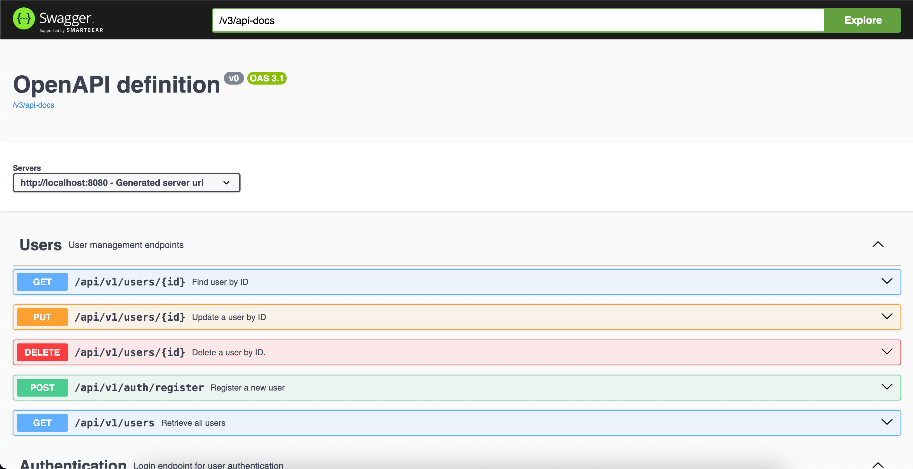
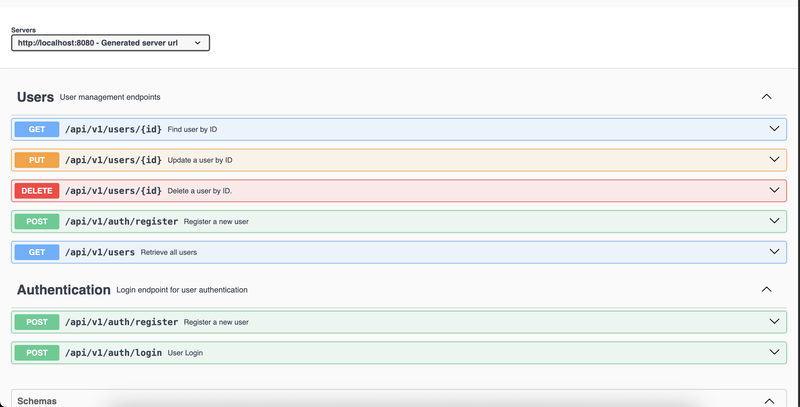
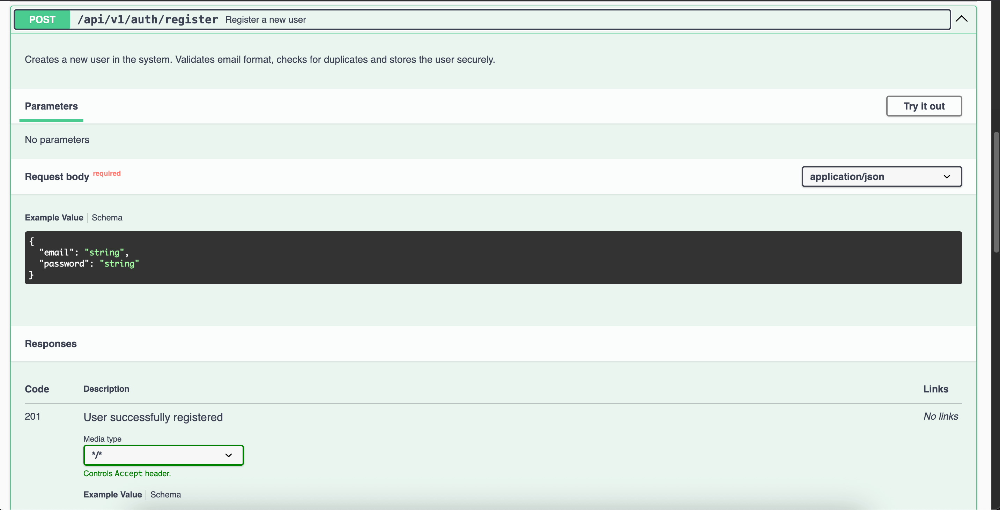
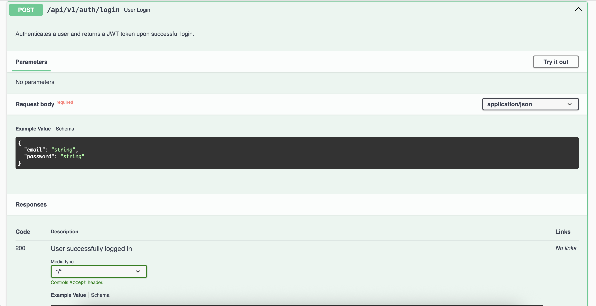

# 🏋️ Gym Management System

Sistema de gestión para gimnasios con autenticación JWT y arquitectura hexagonal.

## 🚀 Features

- ✅ Registro de usuarios con validación de email
- ✅ Login con JWT authentication
- ✅ CRUD completo de usuarios
- ✅ Arquitectura hexagonal (Clean Architecture)
- ✅ Tests unitarios e integración (22 tests)
- ✅ Spring Security + BCrypt
- ✅ Swagger UI para documentación de API

## 🛠️ Tech Stack

**Backend:**
- Java 17
- Spring Boot 3.5
- Spring Security
- JWT (JSON Web Tokens)
- JPA/Hibernate
- H2 Database (dev)
- PostgreSQL (prod - preparado)
- Maven

**Architecture:**
- Hexagonal Architecture (Ports & Adapters)
- SOLID principles
- Command pattern
- Repository pattern
- Value objects

## 📸 Screenshots

### Swagger UI


### Auth Endpoints


### Register User


### Login


## 🏃 Quick Start

### Prerequisites
- Java 17+
- Maven 3.8+

### Installation

1. Clone el repositorio
```bash
git clone https://github.com/emadeveloper/fullstack-template.git
cd gym-management-system/backend
```

2. Configurar variables de entorno
```bash
export JWT_SECRET=your_secret_key_here
export JWT_EXPIRATION=86400000
```

3. Ejecutar la aplicación
```bash
./mvnw spring-boot:run
```

4. Acceder a Swagger UI
```
http://localhost:8080/swagger-ui.html
```

### Testing
```bash
./mvnw test
```

## 📚 API Documentation

### Register User
```bash
POST /api/v1/auth/register
Content-Type: application/json

{
  "email": "user@example.com",
  "password": "SecurePass123"
}
```

**Response:**
```json
{
  "id": "f09479c2-11f0-44ee-9345-153402ef9816",
  "email": "user@example.com",
  "name": null,
  "role": "USER",
  "token": "eyJhbGciOiJIUzI1NiIsInR5cCI6IkpXVCJ9..."
}
```

### Login
```bash
POST /api/v1/auth/login
Content-Type: application/json

{
  "email": "user@example.com",
  "password": "SecurePass123"
}
```

**Response:**
```json
{
  "token": "eyJhbGciOiJIUzI1NiIsInR5cCI6IkpXVCJ9...",
  "user": {
    "id": "f09479c2-11f0-44ee-9345-153402ef9816",
    "email": "user@example.com",
    "name": null,
    "role": "USER"
  }
}
```

### Get All Users (Requires Authentication)
```bash
GET /api/v1/users
Authorization: Bearer 
```

## 🗂️ Project Structure
```
backend/
├── src/
│   ├── main/
│   │   └── java/
│   │       └── com/backend/
│   │           ├── domain/          # Entidades de dominio
│   │           ├── application/     # Casos de uso
│   │           ├── infrastructure/  # Adapters (JPA, REST)
│   │           └── security/        # Config de seguridad
│   └── test/
│       └── java/                    # 22 tests
├── pom.xml
└── README.md
```

## 🔐 Security

- Passwords hasheados con BCrypt (cost factor: 10)
- JWT tokens con expiración configurable
- Endpoints protegidos con Spring Security
- Variables de entorno para secrets


## 👨‍💻 Author

**Emanuel Martinez**
- GitHub: [@emadeveloper](https://github.com/emadeveloper)
- LinkedIn: [@Emanuel-david-martínez](https://linkedin.com/in/emanuel-david-martinez)

## 📄 License

Este proyecto es de código abierto bajo la licencia MIT.
